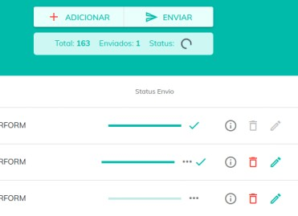

# Novidades da versão

---

## Youk App 1.4.0 (22/09/2022)

### 🚀Novo

- `Login por CPF [YA-16]` - Agora o acesso ao aplicativo é realizado pelo CPF do usuário.

- `Redefinição de senha pelo CPF[YA-71]` - Agora a solicitação de redefinição de senha do aplicativo é pelo CPF do usuário. Sendo enviado o link de alteração de senha para o e-mail cadastrado.

- `Recuperação da Conta [YA-72]` - Criado recurso para o usuário solicitar a recuperação da conta. A recuperação da conta é indicada quando o usuário realizou cadastro com algum dado incorreto.

---

## Youk Manager 1.2.1 (19/01/2022)

### 🌟 Melhorias

- `Envio de documentos (Arquivos) [YM-111]` - Proteção para que só seja possível clicar em enviar arquivo uma única vez.

- `Envio de documentos (Arquivos) [YM-111]` - Realizada uma melhoria visual na tela de envio de documentos onde mostrará quantos eventos estão na fila, quantos ainda faltam enviar e também o status de envio.

  

- `Envio de documentos (Arquivos) [YM-127]` - Ajuste interno para enviar **Informe de Rendimentos por (PDF / Imagem)**, através da tela "Envio". Se essa opção "Envio" não estiver habilitada no menu lateral, deve solicitar ao suporte que habilite, para assim conseguir enviar os Informes de Rendimentos por PDF.

### 🔧 Correções

- `Envio de documentos (Planilha) [YM-124]` - Foi criada uma proteção para não deixar importar uma planilha com duas ou mais férias do mesmo ano para o mesmo colaborador. Caso precise importar duas férias no mesmo ano para o mesmo colaborador é preciso separá-las em planilhas diferentes. (Ex: Férias do João no mês 03/2021 na planilha A e Férias do João no mês 07/2021 na planilha B).

---

## Youk App 1.2.0 (22/12/2021)

### 🚀 Novo

- `Assinatura digital [YA-17]` - Novo recurso onde o colaborador consegue assinar digitalmente os documentos assináveis recebidos.

### 🌟 Melhorias

- `Interface [YA-87]` - Melhoria na tela principal, agora todos os eventos importados serão mostrados na aba "Recentes".

---

## Youk Manager 1.2.0 (14/12/2021)

### 🚀 Novo

- `Assinatura digital [YM-37]` - Foi criado um novo recurso para o usuário conseguir assinar digitalmente os documentos recebidos. O gestor também saberá se o documento foi (baixado / visualizado) e assinado. Desta forma, o controle sobre os eventos enviados será maior, trazendo mais segurança e mais detalhes para a gestão.

- `Assinatura digital [YM-87]` - Criada uma nova opção na tela de importação do arquivo para o gestor escolher se o arquivo é assinável.

### 🌟 Melhorias

- `Cadastro de empresas [YM-74]` - Agora também será possível fazer o cadastro de empresas com CAEPF e CNO.

- `Proteção de importação [YM-101]` - Proteção para que não seja possível importar um documento de folha de pagamento em férias.

### 🔧 Correções

- `Listagem de empresas [YM-77]` - Realizada uma correção para que seja possível ordenar as empresas por nome curto.

---
