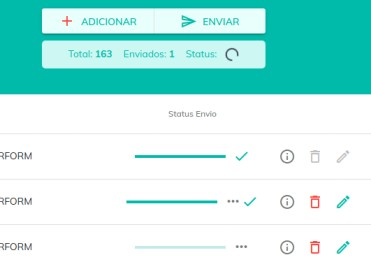

# Novidades da versão

## Youk Manager v1.9.4 (24/06/2024)
 
### 🚀 Novo
 
- `Envio de documentos [YM-569]` - Novo recurso na tela do envio de documentos. A partir de agora, será possível incluir a assinatura da empresa, do gestor e do funcionário no documento. Ao realizar o envio do documento por colaborador, ficará disponível a opção "Adicionar assinaturas". O documento será pré-assinado pela empresa e o gestor que realizará o envio. Ao incluir a assinatura, será possível posiciona-la no documento. Para que o gestor possa incluir o signatário no documento, basta acessar o menu lateral, aba cadastros, gestores, acessando o cadastro a opção "Habilitar signatário" deverá estar marcada, acessando também a aba perfis, o perfil vinculado ao gestor deverá estar com a opção "Permitir controlar gestores, perfis e assinaturas." marcada.  
 
- `Cadastro da empresa [YM-33]` - Criado um novo recurso no cadastro da empresa. Agora, será possível incluir a logo marca no cadastro da empresa. Acessando o menu lateral, aba cadastros, empresas. A logo marca será levada nos recibos enviados na aba "Transmitir recibos". 
 
### 🌟 Melhorias
 
- `Enviar Documentos [YM-592]` - Melhoria no envio de documentos. A partir de agora, será possível enviar documento com até 5mb.
 
- `Histórico [YM-658]` - Melhoria interna na aba histórico. A partir de agora, pode realizar o filtro sem que seja obrigatório preencher algum campo, flexibilizando as opções do filtro. 
 
---

## Youk Manager v1.9.3 (24/06/2024)
 
### 🌟 Melhorias
 
- `Sistema de notificações [YM-616]` - Ajustes internos na tela do sistema de notificações, para que fique no padrão do sistema.

- `Sistema de notificações [YM-613]` - Melhoria na paginação da tela de notificações. Para que seja levado a quantidade correta de itens da página.

---

## Youk Manager v1.9.2 (05/02/2024)

### 🚀 Novo

- `Sistema de notificações [YM-613]` - Criado recurso para envio de notificações. Basta acessar a plataforma de gestão, através da aba "comunicação", clicar em "sistema de notificação". Aqui será possível enviar notificação para os colaboradores, incluindo título e a mensagem da notificação que deseja enviar. Você pode ainda enviar a notificação filtrando por empresa, departamento ou por grupo. Os gestores conseguem visualizar o status da notificação, filtrando por agendado, enviado, cancelado e excluído. Ao abrir a notificação, é possível acompanhar o status da mesma, para cada funcionário. Assim ficará sabendo se a notificação está pendente de envio, enviada, entregue ou se já foi visualizada pelo colaborador.  
  
### 🌟 Melhorias  

- `Perfil de acesso [YM-606]` - Melhoria interna no perfil de acesso, para que seja possível vincular até 30 empresas no mesmo perfil.

---

## Youk Manager v1.9.0 (21/11/2023)
 
### 🚀 Novo
 
- `Envio de outros tipos de documentos  [YM-256]` - A partir de agora, é possível enviar outros tipos de documentos em formato PDF, como por exemplo: “Notificação de advertência”, “Espelho de Ponto” ou qualquer outro que deseje enviar ao colaborador. Através da plataforma de gestão, você poderá criar os “tipos de eventos” que deseja enviar, e depois através da aba “enviar documentos”, você transmite aos colaboradores esses documentos. O modo de salvar os documentos em uma pasta deverá ser o mesmo que os demais, contendo na descrição do arquivo um dos dados: CPF, nome do colaborador, código externo ou código do cartão de ponto.  
 
- `Notificações do mural de aviso [YM-508]` - Novo recurso de notificação para o mural de avisos. Agora, quando for criado um novo mural de aviso, é possível notificar o colaborador. Essa notificação é configurada no momento em que cria o aviso, através dela poderá notificar o funcionário imediatamente ou até mesmo agendar a notificação com a data e hora de quando deseja notificar.
 
### 🌟 Melhorias
 
- `Importar colaboradores [YM-404]` - Melhoria interna para aumentar o limite de usuários a serem importados por planilha. Agora é possível importar até 2000 colaboradores no mesmo arquivo.
 
- `Cadastro de colaboradores [YM-524]` - Melhoria no cadastro dos colaboradores, para quando mais de um gestor estiver com o cadastro do colaborador aberto e realizar alterações, será apresentado o ícone “atualizar formulário” e ao clicar o cadastro será atualizado. 
 
- `Contador de colaboradores [YM-538]` - Melhoria interna, para quando criar ou excluir um colaborador, o contador de colaboradores seja atualizado de imediato. 

---

## Youk Manager v1.8.0 (18/09/2023)
 
### 🌟 Melhorias
 
- `Histórico/Envio de documentos [YM-501]` - Ajuste interno nas abas "Histórico" e "Transmitir Recibos",  para melhorar a performance dos processamentos, garantindo assim maior velocidade.

- `Envio de documentos [YM-443]` - Ajuste interno na aba "Enviar", para que ao editar o  envio de documentos, o sistema leve a configuração correta nos campos assinar eventos, retificar eventos e método de importação. 

- `Cadastro do colaborador [YM-7]` - A partir de agora, no cadastro de colaborador, quando estiver cadastrando um novo  e tiver apenas uma empresa cadastrada na plataforma, o sistema  irá inserir no campo "Empresa" a única empresa cadastrada. 

- `Colaboradores [YM-68]` - Ajuste interno na aba "Colaboradores" para que o campo "Buscar" localize pelo nome do colaborador, documento e nome da empresa. 

- `Mural de avisos [YM-326]` - Melhoria na aba de "Mural de avisos", para que seja  possível pesquisar o nome ou documento do colaborador que está vinculado ao aviso. 

- `Mural de avisos [YM-325]` - Ajuste interno na aba "Mural de avisos", para exibir os avisos excluídos apenas se filtrar por "Excluídos"

- `Mural de avisos [YM-324]` - Melhoria na aba "Mural de avisos", para que seja possível incluir um colaborador quando o aviso estiver com o status de "Exibindo" ou  "Aguardando exibição".

- `Mural de avisos [YM- 462]` - Ajuste interno na aba “Mural de avisos” para criar o aviso selecionando a empresa, departamento e o grupo que o colaborador pertence. 

### 🔧 Correções
 
- `Colaboradores  [YM-442]` - Ajuste interno na aba "Colaboradores", para ao importar os colaboradores exibir a mensagem de aviso sobre quantos colaboradores estão ultrapassando a quantidade disponível na licença. 

---

## Youk Manager v1.7.0 (11/07/2023)
 
### 🚀 Novo
 
- `Evento de folha complementar [YM-302]` -  Criado a possibilidade de enviar o evento de folha de pagamento complementar dentro da plataforma Youk Manager.
 
### 🌟 Melhorias
 
- `Assinatura digital [YM-257]` - Melhoria na assinatura digital. A partir de agora, o funcionário consegue visualizar a assinatura e é criado um documento levando esta assinatura anexa ao recibo. O colaborador e o gestor conseguem visualizar o documento assinado. 

- `Envio documentos [YM-445]` - Ajuste interno na aba "Enviar", para enviar documentos (arquivos) apenas no formato de PDF, não aceitando mais imagens e outros tipos.

- `Colaborador [YM-424]` - Ajuste para que não seja possível alterar o colaborador para outra empresa, depois do mesmo ter aceitado o vínculo através do Youk App.

 
### 🔧 Correções
 
- `Histórico envio de documentos [YM-459]` - Ajuste interno para não carregar os dados de outra conta, caso saia de uma conta e acesse outra, através do mesmo navegador.

---

## Youk Manager 1.6.0 (18/04/2023)

### 🌟 Melhorias

- `Importação de recibos [YM-347]` - Melhoria na importação de recibos, para que seja separada por departamento e função, se na importação for identificado que é para o mesmo funcionário, porém, o departamento ou função forem diferentes, serão separados.

- `Cadastro de colaborador [YM-316]` - Melhoria para permitir exportar a listagem de colaboradores em CSV ou XLSX.

- `Importação de recibos [YM-342]` - Melhoria no campo de "Aviso" do recibo de folha de pagamento, para que leve esta informação, caso tenha.

- `Cadastro de colaborador [YM-389]` - Melhoria nos filtros do cadastro de colaborador, para que as combinações de "Situação" e "Status" fiquem mais precisas.

- `Importação de colaborador [YM-392]` - Melhoria na mensagem da importação do colaborador, para quando existir mais de 1000 linhas na planilha, fique visível a quantidade limite de importação por planilha.

- `Importação de recibos [YM-400]` - Melhoria para permitir cadastrar o colaborador através da importação de recibo, mesmo que estiver desativado, caso ele ainda não tenha sido registrado.

### 🔧 Correções

- `Importação de recibos [YM-400]` - Ajuste interno ao importar o recibo de funcionários demitidos, para que os colaboradores não sejam reativados.

---

## Youk Manager 1.5.1 (10/04/2023)

### 🌟 Melhorias

- `Importação de colaboradores [YM-347]` - A importação do colaborador passa a cadastrar o departamento e o grupo caso ainda não estejam cadastrados.

- `Importação de colaboradores [YM-349]` - O tamanho do campo de departamento e grupo foram ajustados para um total de 50 caracteres.

- `Importação de colaboradores [YM-356]` - As mensagens de retorno de importação foram melhoradas para que fique mais fácil de entender o que houve na hora da importação.

- `Importação de colaboradores [YM-358]` - Ajuste interno para importar corretamente a planilha se na mesma existirem pessoas com data de desligamento e pessoas novas. Assim, o sistema vai desligar quem possuir data de desligamento e cadastrar os demais.

- `Recibos [YM-383]` - Aumentamos o tamanho dos campos cargo, nome da empresa e nome do usuário.

- `Recibos [YM-383]` - Ajuste interno para aumentar o tamanho dos campos do cargo, nome da empresa e nome do usuário nos recibos.

- `Importação de recibos [YM-386]` - Foi limitado o máximo de caracteres permitidos no campo cargo para 50, ou seja, caso na importação o campo cargo tenha um nome maior que 50 dígitos, será importado com a quantidade máxima de 50 dígitos.

---

## Youk Manager 1.5.0 (17/03/2023)

### 🚀 Novo

- `Permissão de acesso [YM-228]` - Agora é possível configurar qual empresa o gestor poderá visualizar.

---

## Youk Manager 1.4.0 (23/02/2023)

### 🚀 Novo

- `Colaboradores [YM-240]` - Agora no cadastro de colaboradores, existe a possibilidade de filtrar por usuários: "Ativos, desligados e todos".

- `Informe de rendimentos [YM-204]` - Disponibilizamos o envio de informe de rendimentos através do formato PDF.

- `Site do App [YM-318]` - No canto superior direito, foi adicionado uma opção para acessar o link do aplicativo, onde terão todas as informações do aplicativo, link da loja, especificações técnicas, etc.

- `Mural de avisos [YM-232]` - Agora, o gestor conseguirá enviar avisos que será exibido no aplicativo dos funcionários em forma de "Mural de avisos", podendo utilizar imagens, links e mensagens. O Envio desses avisos podem ser feitos por empresa, departamento ou grupo de pessoas. Ou seja, você pode disponibilizar vários avisos de forma personalizada separando por essas 3 opções: empresa, departamento ou grupo.

### 🌟 Melhorias

- `Tutorial de transmissão dos recibos [YM-282]` - Ajuste interno no tutorial, e também, incluímos o tutorial de exportação da Prosoft.

- `Importação de colaborador [YM-306]` - Ajuste interno na importação de colaboradores por planilha, para que, quando o usuário tiver uma data de desligamento preenchida na planilha, esse será desligado na plataforma de gestão, possibilitando fazer desligamentos coletivos com mais facilidade.

- `Importação de colaborador [YM-310]` - Ajuste interno na importação de colaboradores para que ela não seja mais interrompida quando na planilha já existe um colaborador cadastrado. Dessa forma, a importação continuará e caso tenha uma nova informação na planilha do funcionário já cadastrado, essa informação também será atualizada na plataforma.

- `Importação de colaborador [YM-290]` - Passou a ser possível importar colaboradores de empresas com: "CNO e CAEPF".

- `Cadastro de colaborador [YM-230]` - Agora, é possível cadastrar usuários com o mesmo CPF em empresas diferentes.

- `Importação de eventos [YM-314]` - Caso faça a transmissão de recibos e na planilha tenha algum colaborador que ainda não está cadastrado na plataforma de gestão, o sistema vai cadastrar esse funcionário com os dados que tem na planilha de recibos, e a transmissão dos eventos continuará sendo feita normalmente.

### 🔧 Correções

- `Importação de colaborador [YM-296]` - Ajuste interno no arquivo de exemplo da importação de colaboradores.

---

## Youk App 1.5.0 (10/11/2022)

### 🚀 Novo

- `Solicitação de vinculo com a empresa [YA-93]` - Após a criação da conta pelo usuário, o sistema vai apresentar todas as empresas já vinculadas para ele, podendo aceitar ou recusar cada vinculo.

- `Usuário solicitar a exclusão da conta [YA-94]` - Criado novo recurso para que o usuário consiga fazer a solicitação da exclusão da sua conta através do aplicativo.

---

## Youk Manager 1.3.0 (10/11/2022)

### 🌟 Melhorias

- `Importação de arquivo [YM-193]` - Melhoria na importação de eventos/colaboradores por arquivo para aceitar campos de datas com formato fora do esperado.

- `Cadastro de colaborador [YM-167]` - Agora o gestor consegue cadastrar o colaborador direto pelo manager, mesmo que o colaborador não tenha feito o cadastro pelo aplicativo previamente.

- `Status do colaborador [YM-170]` - Adicionado um novo campo de status do colaborador, são eles: Pendente, Aceito e Rejeitado. (Esses status irão indicar para o gestor se o colaborador aceitou ou não receber comprovantes da empresa).

- `Filtro de status [YM-172]` - Na aba colaboradores foi adicionado um novo filtro de "Status".

- `Histórico de recibos [YM-177]` - Foi adicionado uma nova coluna chamada de "Status entrega", onde o gestor conseguirá saber se o recibo foi entregue, se está aguardando aprovação do colaborador ou se foi rejeitado.

- `Histórico de recibos [YM-175]` - Agora o gestor consegue fazer o envio do recibo mesmo que o colaborador não tenha feito o cadastro previamente no aplicativo.

- `Histórico de recibos [YM-189]` - Agora será possível exportar em xlxs ou csv os dados filtrados no grid.

- `Importação de colaborador [YM-200]` - Removida a obrigatoriedade de fornecer um CEP válido.

- `Eventos [YM-180]` - Removida a obrigatoriedade de fornecer um CEP válido.

- `Exclusão de conta [YM-212]` - Caso o colaborador exclua sua conta, o status de vínculo dele passará a ser "ENCERRADO".

- `Recibos em PDF [YM-216]` - O CPF do colaborador passou a aparecer no local do que antes era o "código_único".

- `Recibo de férias [YM-222]` - Os campos: faltas, periodo_aquisitivo, aliquota_inss e data_notificacao, passam a ser obrigatórios.

---

## Youk App 1.4.0 (22/09/2022)

### 🚀 Novo

- `Login por CPF [YA-16]` - Agora o acesso ao aplicativo é realizado pelo CPF do usuário.

- `Redefinição de senha pelo CPF[YA-71]` - Agora a solicitação de redefinição de senha do aplicativo é pelo CPF do usuário. Sendo enviado o link de alteração de senha para o e-mail cadastrado.

- `Recuperação da Conta [YA-72]` - Criado recurso para o usuário solicitar a recuperação da conta. A recuperação da conta é indicada quando o usuário realizou cadastro com algum dado incorreto.

---

## Youk Manager 1.2.1 (19/01/2022)

### 🌟 Melhorias

- `Envio de documentos (Arquivos) [YM-111]` - Proteção para que só seja possível clicar em enviar arquivo uma única vez.

- `Envio de documentos (Arquivos) [YM-111]` - Realizada uma melhoria visual na tela de envio de documentos onde mostrará quantos eventos estão na fila, quantos ainda faltam enviar e também o status de envio.

  

- `Envio de documentos (Arquivos) [YM-127]` - Ajuste interno para enviar **Informe de Rendimentos por (PDF / Imagem)**, através da tela "Envio". Se essa opção "Envio" não estiver habilitada no menu lateral, deve solicitar ao suporte que habilite, para assim conseguir enviar os Informes de Rendimentos por PDF.

### 🔧 Correções

- `Envio de documentos (Planilha) [YM-124]` - Foi criada uma proteção para não deixar importar uma planilha com duas ou mais férias do mesmo ano para o mesmo colaborador. Caso precise importar duas férias no mesmo ano para o mesmo colaborador é preciso separá-las em planilhas diferentes. (Ex: Férias do João no mês 03/2021 na planilha A e Férias do João no mês 07/2021 na planilha B).

---

## Youk App 1.2.0 (22/12/2021)

### 🚀 Novo

- `Assinatura digital [YA-17]` - Novo recurso onde o colaborador consegue assinar digitalmente os documentos assináveis recebidos.

### 🌟 Melhorias

- `Interface [YA-87]` - Melhoria na tela principal, agora todos os eventos importados serão mostrados na aba "Recentes".

---

## Youk Manager 1.2.0 (14/12/2021)

### 🚀 Novo

- `Assinatura digital [YM-37]` - Foi criado um novo recurso para o usuário conseguir assinar digitalmente os documentos recebidos. O gestor também saberá se o documento foi (baixado / visualizado) e assinado. Desta forma, o controle sobre os eventos enviados será maior, trazendo mais segurança e mais detalhes para a gestão.

- `Assinatura digital [YM-87]` - Criada uma nova opção na tela de importação do arquivo para o gestor escolher se o arquivo é assinável.

### 🌟 Melhorias

- `Cadastro de empresas [YM-74]` - Agora também será possível fazer o cadastro de empresas com CAEPF e CNO.

- `Proteção de importação [YM-101]` - Proteção para que não seja possível importar um documento de folha de pagamento em férias.

### 🔧 Correções

- `Listagem de empresas [YM-77]` - Realizada uma correção para que seja possível ordenar as empresas por nome curto.

---
